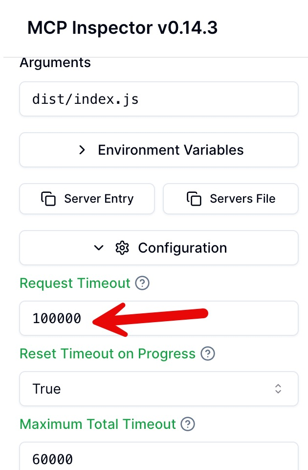

## OCR an Utility Bill document

You can find sample utility bill documents in the `sample-documents` folder at the root of this project.

The path to use for `documentFilepath` will vary due to your filesystem. For reference, here's mine:
`/Users/mattnetkow/Documents/src/abbyy/mcp/workshop-mcp-abbyy-bank/sample-documents/UtilityBill_2.pdf`

## Timeout Error

Note: You may get a timeout error when running the Upload Utility Bill tool in MCP Inspector. To work around this, increase the timeout setting. Update Request Timeout to be "100000".

